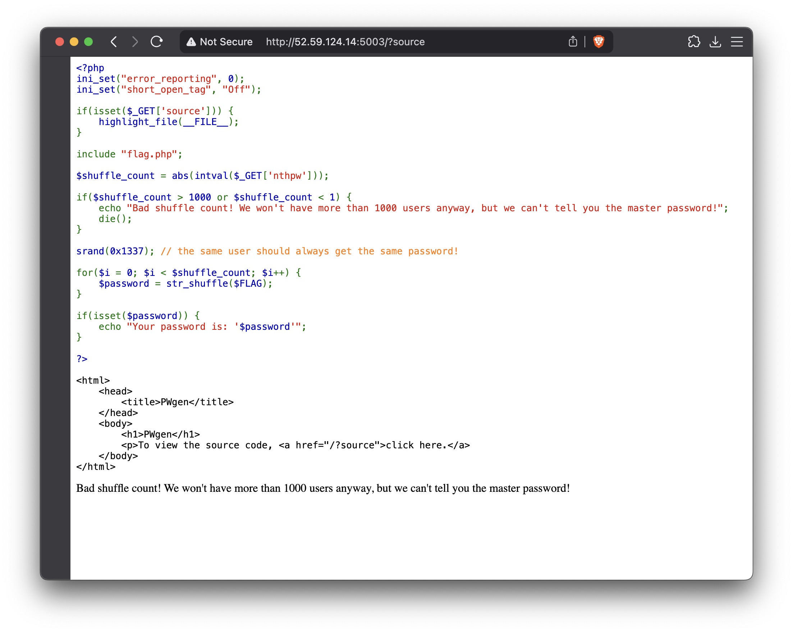

# pwgen [WEB]

> Password policies aren't always great. That's why we generate passwords for our users based on a strong master password! \
> By @gehaxelt

When opening the challenge (`http://52.59.124.14:5003`), we get a blank page saying...

```
Bad shuffle count! We won't have more than 1000 users anyway, but we can't tell you the master password!
```

After spending a bit of time on other challenges, I recognized a pattern
with the creator of the challenges where the source code can be obtained
by adding the `?source` query parameter...



...and so this challenge.

## What does the page do?

It gives you the flag shuffled with `str_shuffle` with the seed (`srand`) `0x1337`.
The number of times the flag get shuffled is determined by the `nthpw` query
parameter and must be >1 and <=1000.

With this, we can try out `http://52.59.124.14:5003/?source&nthpw=1` so we
can get the flag shuffled only once.

```
7F6_23Ha8:5E4N3_/e27833D4S5cNaT_1i_O46STLf3r-4AH6133bdTO5p419U0n53Rdc80F4_Lb6_65BSeWb38f86{dGTf4}eE8__SW4Dp86_4f1VNH8H_C10e7L62154
```

We can't do anything with this so let's try to find anyway to unshuffle this.

## Unshuffle

By scrolling through the PHP `str_shuffle` documentation page, in the comments,
I found [someone who dropped](https://www.php.net/manual/en/function.str-shuffle.php#125039) a function that unshuffles the string.

```php
<?php
$string = "Hello World!";

$seed = 1234567890;
mt_srand($seed);

echo $sh = str_shuffle($string);  //print 'eloWHl rodl!'
echo str_unshuffle($sh, $seed); //print 'Hello World!'
?>

<?php
function str_unshuffle($str, $seed){
    $unique = implode(array_map('chr',range(0,254)));
    $none   = chr(255);
    $slen   = strlen($str);
    $c      = intval(ceil($slen/255));
    $r      = '';

    for($i=0; $i<$c; $i++){
        $aaa = str_repeat($none, $i*255);
        $bbb = (($i+1)<$c) ? $unique : substr($unique, 0, $slen%255);
        $ccc = (($i+1)<$c) ? str_repeat($none, strlen($str)-($i+1)*255) : "";
        $tmp = $aaa.$bbb.$ccc;
        mt_srand($seed);
        $sh  = str_shuffle($tmp);
        for($j=0; $j<strlen($bbb); $j++){
            $r .= $str{strpos($sh, $unique{$j})};
        }
    }
    return $r;
}
```

That's perfect let's try this!

## Get the flag

Since I've installed PHP 8, I had to do some small changes in the script
to prevent syntax errors.

```php
<?php
function str_unshuffle($str, $seed) {
  $unique = implode(array_map('chr', range(0, 254)));
  $none = chr(255);
  $slen = strlen($str);
  $c = intval(ceil($slen / 255));
  $r = '';
  for ($i = 0; $i < $c; $i++) {
    $aaa = str_repeat($none, $i * 255);
    $bbb = (($i + 1) < $c) ? $unique : substr($unique, 0, $slen % 255);
    $ccc = (($i + 1) < $c) ? str_repeat($none, strlen($str) - ($i + 1) * 255) : "";
    $tmp = $aaa . $bbb . $ccc;
    mt_srand($seed);
    $sh = str_shuffle($tmp);
    for ($j = 0; $j < strlen($bbb); $j++) {
      $r .= $str[strpos($sh, $unique[$j])];
    }
  }
  return $r;
}

echo str_unshuffle("7F6_23Ha8:5E4N3_/e27833D4S5cNaT_1i_O46STLf3r-4AH6133bdTO5p419U0n53Rdc80F4_Lb6_65BSeWb38f86{dGTf4}eE8__SW4Dp86_4f1VNH8H_C10e7L62154", 0x1337);
```

```bash
php unshuffle.php
ENO{N3V3r_SHUFFLE_W1TH_STAT1C_S333D_OR_B4D_TH1NGS_WiLL_H4pp3n:-/_0d68ea85d88ba14eb6238776845542cf6fe560936f128404e8c14bd5544636f7}
```

There we go!
