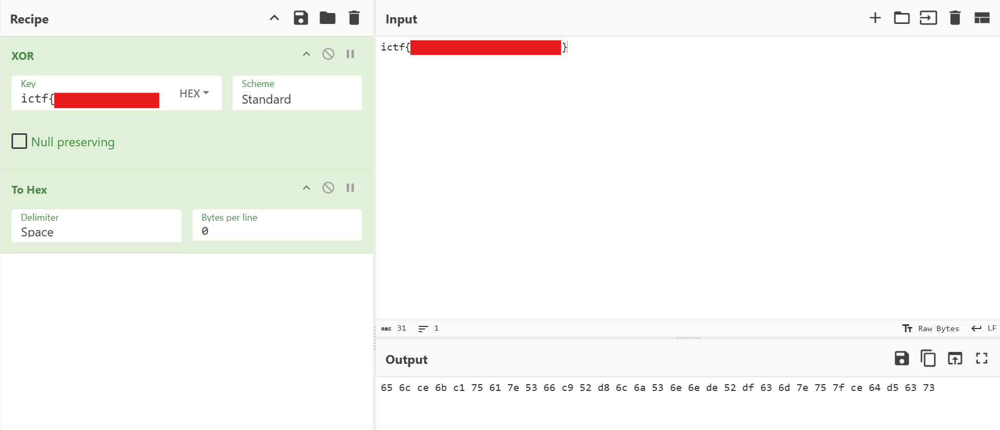

# redacted [CRYPTO]

> wait, i thought XORing something with itself gives all 0s??? \
> by @Eth007



We can see here that the flag is contained in the `Key` and the `Input`.

The reason why the XOR isn't giving all 0s is because the key is in `HEX` and not in `UTF8`!

## Bruteforcing

We know the prefix is `ictf{` and the end is `{`, let's simply bruteforce.

```python
C = [0x65,0x6c,0xce,0x6b,0xc1,0x75,0x61,0x7e,0x53,0x66,0xc9,0x52,0xd8,0x6c,0x6a,0x53,0x6e,0x6e,0xde,0x52,0xdf,0x63,0x6d,0x7e,0x75,0x7f,0xce,0x64,0xd5,0x63,0x73]
key_prefix = [0x0c,0x0f,0xba,0x0d,0xba]
k6 = 0x0e

possible_flags: list[str] = []

for x in range(256):
  for y in range(256):
    all_good = True
    p = [0]*31
    for i in range(31):
      mod = i % 8
      if mod < 5:
        k_i = key_prefix[mod]
      elif mod == 5:
        k_i = x
      elif mod == 6:
        k_i = k6
      else:
        k_i = y
      p[i] = C[i] ^ k_i
      if not (32 <= p[i] <= 126):
        all_good = False
        break
    if all_good:
      flag = ''.join(chr(pp) for pp in p)
      possible_flags.append(flag)

print("\n".join(possible_flags))
```

## Execute and find the flag!

```bash
$ python3 main.py
...
ictf{Xow_is_bAdZbad_eNcwyptioN}
ictf{Xot_is_bAdYbad_eNctyptioN}
ictf{Xou_is_bAdXbad_eNcuyptioN}
ictf{Xor_is_bAd_bad_eNcryptioN}
ictf{Xos_is_bAd^bad_eNcsyptioN}
ictf{Xop_is_bAd]bad_eNcpyptioN}
...
```

I found something readable at the middle of the output and guessed `ictf{Xor_is_bAd_bad_eNcryptioN}` and it was correct!
