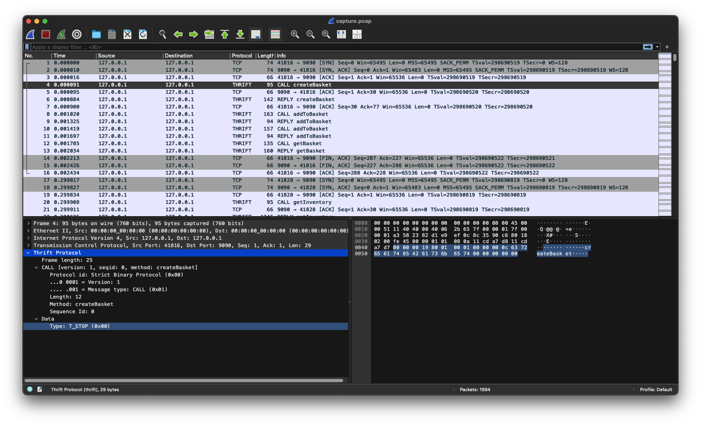
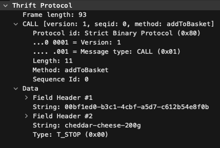
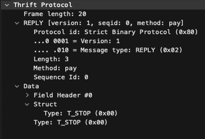
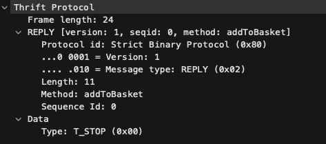

# `thrift-store` [FORENSICS]

> The frontend has gone down but the store is still open, can you buy the flag? \
> [`capture.pcap` file](backup/imaginaryctf_thrift_store_capture.pcap) is attached. \
> By @Ciaran

## Opening in Wireshark



We can see we're calling a server using the THRIFT protocol.

## What is Thrift?

> The Apache Thrift software framework, for scalable cross-language services development, combines a software stack with a code generation engine to build services that work efficiently and seamlessly between C++, Java, Python, PHP, Ruby, Erlang, Perl, Haskell, C#, Cocoa, JavaScript, Node.js, Smalltalk, OCaml and Delphi and other languages.
>
> \_Taken from <https://thrift.apache.org/>.\*

So, this means we can call the server ourselves if we have a thrist file!
Even though, we don't and we need to create ours by reading this capture.

## Creating our own `store.thrift` file

After reversing all the calls and replies, I got this file.

```thrift
namespace py store

struct Item {
  1: string id,
  2: string name,
  3: i64 price_cents,
  4: string description
}

struct Inventory {
  1: list<Item> items
}

struct Basket {
  1: string id
}

struct PaymentReturn {
  1: string flag
}

service Store {
  Inventory getInventory(),
  Basket createBasket(),
  void addToBasket(1: string basket_id, 2: string item_id),
  PaymentReturn pay(1: string basket_id, 2: i64 money)
}
```

### CALLS

When we lookup the protocol frame in Wireshark, we can see the data fields.



Here, the `addToBasket` method requires two fields.
After a bit of investigating on the other replies, you can guess that the
first field is the basket ID and the second field is the item ID!

In Thrift, that would end up in doing this.

```thrift
service Store {
  void addToBasket(1: string basket_id, 2: string item_id)
}
```

### REPLIES

It's pretty much the same for replies, here's how I found the `pay` structure.



On a successful response, it returns a `struct` and so I guessed it should
MAYBE have a value on field `1` if something special happened because
on the reply of `addToBasket` it actually returns nothing - _yes this is why the `void` in front of the method name_!



## Making a Python client to pay `flag` item

```python
from thrift.transport import TSocket, TTransport
from thrift.protocol import TBinaryProtocol
from gen_py.store import Store

sock = TSocket.TSocket("thrift-store.chal.imaginaryctf.org", 9090)
transport = TTransport.TFramedTransport(sock)
protocol = TBinaryProtocol.TBinaryProtocol(transport)
client = Store.Client(protocol)

transport.open()

# the flag item always appeared as the last item of the inventory
flag_item = client.getInventory().items[-1]
print(flag_item)

# let's create our basket
basket = client.createBasket()
print(basket)

# add the flag item to our basket
client.addToBasket(basket.id, flag_item.id)

# pay the basket with the price of the flag
payment = client.pay(basket.id, flag_item.price_cents)

# log the flag!
print(payment)

transport.close()
```

Once done, let's run our script!

```bash
$ thrift --gen py store.thrift  # generate a python client!
$ mv gen-py gen_py              # otherwise python won't find it...
$ pip install thrift
$ python main.py
```

```
Item(id='flag', name='Flag', price_cents=9999, description=None)
Basket(id='c3c59b69-9fdb-49b4-996b-58a5a6acf8be')
PaymentReturn(flag='ictf{l1k3_gRPC_bUt_l3ss_g0ogly}')
```

Boom, here's our flag.
